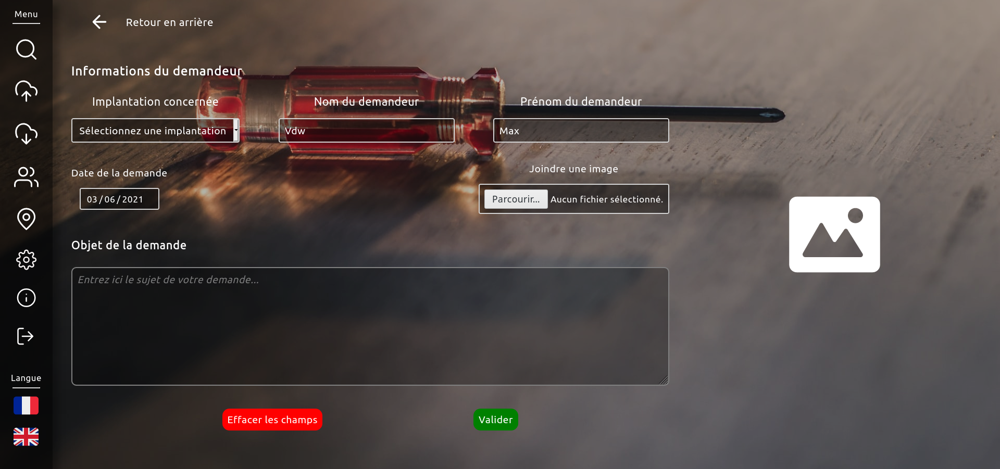
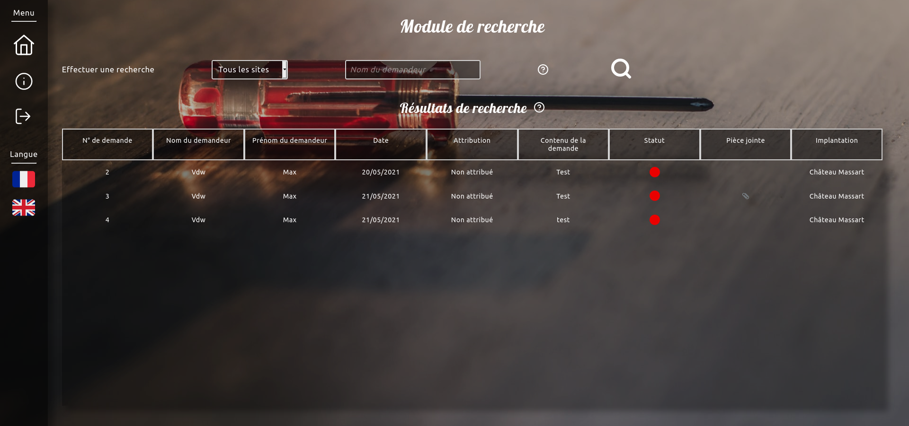
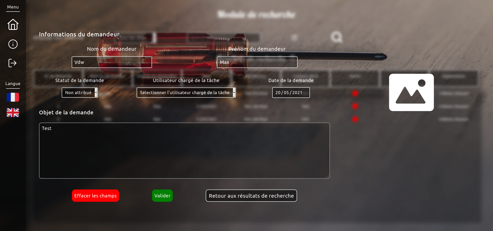
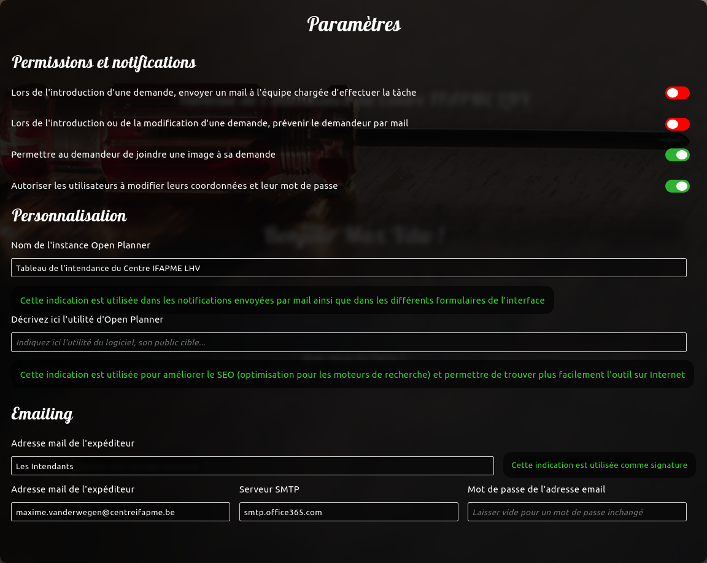

:point_right: As this software was first intended to be used in a French-speaking business, the following README is written in French. The whole project is currently being translated in English.

# Introduction

Ce programme est une application web qui a pour but de faciliter la gestion des tâches d'une équipe d'ouvriers et leur communication avec les différentes équipes composant une entreprise.

_Open Planner_ a été créé sur mesure pour l'ASBL belge _Centre IFAPME Liège-Huy-Verviers_, active dans le secteur de la promotion sociale.

# Prérequis

Afin de fonctionner de manière optimale, cette application nécessite les éléments suivants :

- Elle doit être installée dans un environnement de type Linux
- Un serveur de base de données [PostgreSQL](https://www.postgresql.org) en version `<= 9`
- [Node.js](https://nodejs.org) en version `<= 10`

Le serveur de base de données et la plateforme Node.js peuvent être installés très facilement depuis le gestionnaire de paquets de la distribution Linux utilisée (par exemple, sous Ubuntu/Debian via la commande `sudo apt install -y nodejs postgresql`, consultez la documentation de votre distribution si celle-ci n'est pas basée sur Debian).

# Mise en place

:point_right: Ces instructions peuvent paraître compliquées à suivre pour tout qui n'est pas familier avec le domaine de l'informatique. N'hésitez donc pas à [ouvrir une issue](https://github.com/belgianGeek/open-planner/issues/new) afin d'obtenir de l'aide.

Le logiciel _Open Planner_ peut être téléchargé et installé en quelques clics, une fois les prérequis satisfaits.

Pour télécharger le programme, vous pouvez soit cloner ce dépôt dans un dossier sur votre ordinateur (attention, cela nécessite d'avoir installé [Git](https://git-scm.com/) au préalable !) via la commande `git clone https://github.com/belgianGeek/open-planner.git /home/$user/Documents/open-planner` ou simplement télécharger l'ensemble des fichiers au format `.zip` et les déplacer ensuite dans le dossier de votre choix sur votre ordinateur.

Vous devrez ensuite configurer le serveur de base de données. Vous devez pour ce faire vous connecter avec l'utilisateur Postgres dans un terminal, en éxecutant la commande `sudo -i -u postgres` puis en lançant l'instruction `su - postgres -c "initdb --locale en_US.UTF-8 -D '/var/lib/postgres/data'"` pour créer le jeu de données de base du serveur PostgreSQL.

Le serveur de base de données PostgreSQL doit être actif pour assurer le bon fonctionnement du logiciel. Pour démarrer le service, vous pouvez donc entrer la commande `sudo systemctl start postgresql` dans un terminal. Afin que le service soit démarré à chaque allumage de votre ordinateur, vous devez exécutez la commande `sudo systemctl enable postgresql`.

Pour finaliser l'installation, vous n'avez plus qu'à démarrer le programme en ouvrant une fenêtre de terminal, en vous rendant dans le dossier où vous avez placé les fichiers du programme (au moyen de la commande `cd dossier-d'open-planner`) et exécuter la commande `npm run start`. Cette comande aura pour effet d'afficher plusieurs lignes, y compris un lien vous permettant de vous connecter à l'interface et de terminer la configuration grâce à un menu d'introduction qui vous guidera étape par étape.

# Utilisation

## Principes de base

Open Planner est destiné à être utilisé dans les entreprises comptant plusieurs implantations. Il a été créé afin de faciliter la communication entre le personnel et les équipes chargées d'effectuer les travaux.

Chaque implantation est donc liée à une adresse email, qui recevra les notifications des demandes rentrées par les utilisateurs. Cette adresse doit de préférence être celle permettant d'entrer directement en contact avec l'équipe chargée de la tâche sur l'implantation spécifiée.

## Comptes utilisateurs

Il existe 3 types de comptes, chacun ayant des droits particuliers :

- Les visiteurs peuvent entrer une demande et visualiser leur état, sans possibilité d'agir sur celles-ci. **Une fois qu'une demande est ajoutée, un visiteur ne peut pas la modifier.**
- Les utilisateurs peuvent agir sur les demandes (attribution, ajout de commentaires) et exporter l'ensemble des tâches, ce qui peut être utile à des fins statistiques ou pour rédiger un rapport par exemple.
- Les administrateurs ont tous les droits précités mais peuvent également gérer les utlisateurs, les implantations et l'ensemble des paramètres d'Open Planner (envoi d'emails, autoriser les pièces jointes...).

## Introduire une demande d'intervention

Pour introduire, une nouvelle demande, il suffit de se connecter à l'interface d'_Open Planner_ et à cliquer sur le bouton _Rentrer une nouvelle demande_ situé sur la page d'accueil. Un formulaire va alors s'afficher avec le contenu suivant :

Comme vous pouvez le voir, vos noms et prénom sont déjà indiqués. Vous n'avez donc qu'à sélectionner l'implantation concernée par votre demande ainsi que votre message et le tour est joué !

Si certains champs sont préremplis, tous restent modifiables : vous pouvez adapter vos coordonnées, la date... et même ajouter une image illustrant votre demande.

Si l'administrateur du logiciel a activé les notifications par email, l'équipe chargée d'effectuer l'intervention sera prévenue de cette manière. L'utilisateur peut également recevoir un email de confirmation pour autant que l'administrateur l'ait autorisé.

## Recherche

Il est possible de visualiser l'ensemble des demandes via l'onglet de recherche du programme :

Par défaut, toutes les demandes soint affichées, peu importe l'implantation concernée. Il est néanmoins possible de filtrer les résultats par implantation via un menu déroulant et/ou au moyen du nom du demandeur graĉe au champ de saisie prévu à cet effet.

Les personnes disposant du rôle de "visiteur" ne peuvent que consulter le tableau des demandes, tandis que les utilisateurs et administrateurs peuvent agir sur chacune d'entre elles en effectuant un clic-droit. Il leur est alors possible de mettre à jour le statut de la demande (en attente d'attribution, en cours, terminé) et le travailleur assigné ou bien de la supprimer.

Ce menu de modification a l'aspect suivant :

## Paramétrage

Le menu de paramétrage n'est accessible qu'aux administrateurs et permet de modifier le fonctionnement d'_Open Planner_ en quelques clics. Il est notamment possible de modifier :

- Les permissions données aux utilisateurs (ajout de pièces jointes, modification de coordonnées...)
- Les paramètres d'emailing (serveur SMTP, compte email, signature...)
- Le nom donné au programme en interne à l'entreprise
- La description du programme et son utilité. Ce paramétrage est essentiel à l'optimisation des moteurs de recherche et peut donc s'avérer utile si le programme est hébergé en ligne

Des informations complémentaires sont fournies dans l'interface pour les options plus techniques.

## Export de données et sauvegarde

Il est possible d'exporter des tâches depuis le menu latéral, pour autant que vous ayez a minima le rôle d'utilisateur. Les tâches peuvent être exportées au format CSV ou en format PostgreSQL.

Si le format CSV est sélectionné, le fichier obtenu ne contiendra que les tâches et toutes les informations qui y sont liées.

Par contre, un export au format PostgreSQL contiendra l'ensemble des données de la base de données, la structure des tables... Il s'agit de l'option à sélectionner si vous désirez effectuer une sauvegarde complète du programme.

Dans tous les cas, une sauvegarde complète de base de données est effectuée toutes les 12 heures. Cette action équivaut à exporter manuellement les données au format PostgreSQL comme expliqué ci-dessus.

# Un problème, une question ?

N'hésitez pas à poser une question sur [Github](https://github.com/belgianGeek/open-planner/issues/new) ou à [me contacter par email](mailto:max@maxvdw.ovh).

# Licence

Ce logiciel est mis à la disposition de tous, gratuitement et selon les termes de la licence GNU-GPL v3.
